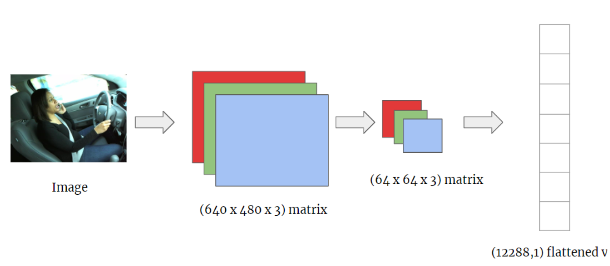

## Data Processing 

### 1. Sobel Data Processing
Sobel Data processing uses sobel operator. The Sobel operator, sometimes called the Sobel–Feldman operator or Sobel filter, is used in image processing and computer vision, particularly within edge detection algorithms where it creates an image emphasising edges.
  

  
`Sobel_Data_Processing.py` will convert Image -> Sobel Image -> Edge-emphasized flattened vectors

### 2. RGB Data Processing
RGB Data Processing will convert each pixel into a 1*3 matrix repersenting RGB value of a pixel.

`RGB_Data_Processing.py` will convert Image -> RGB Image Vector -> flattened vectors
