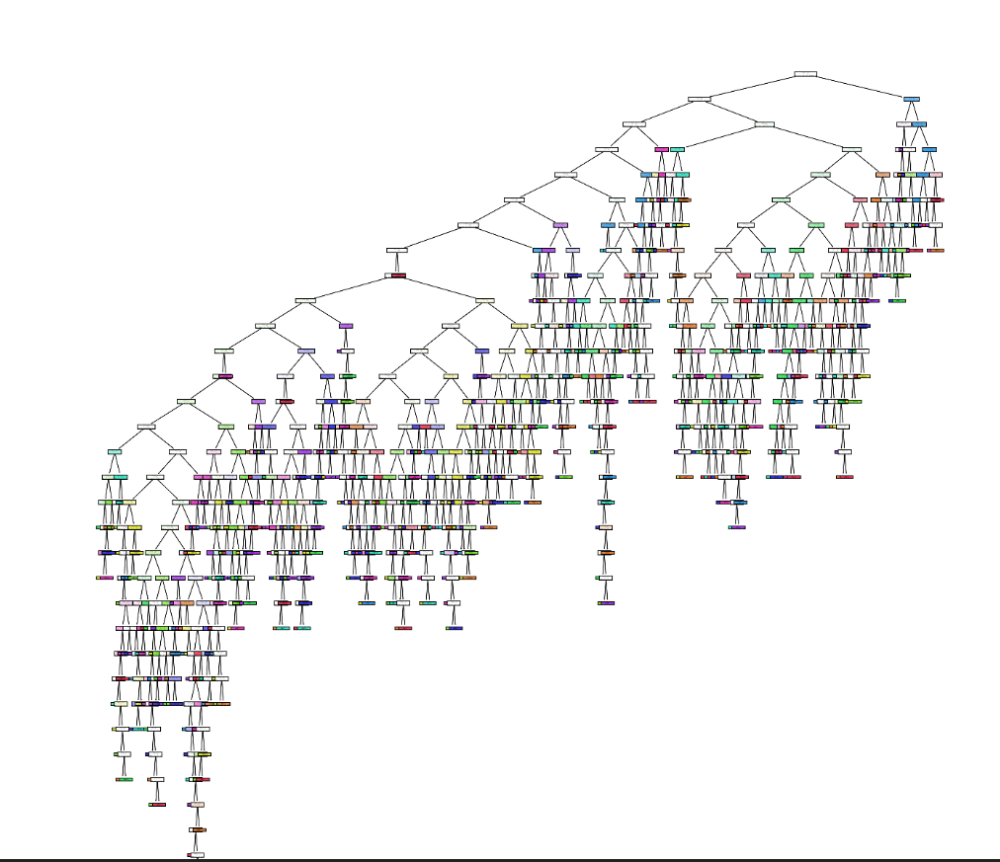
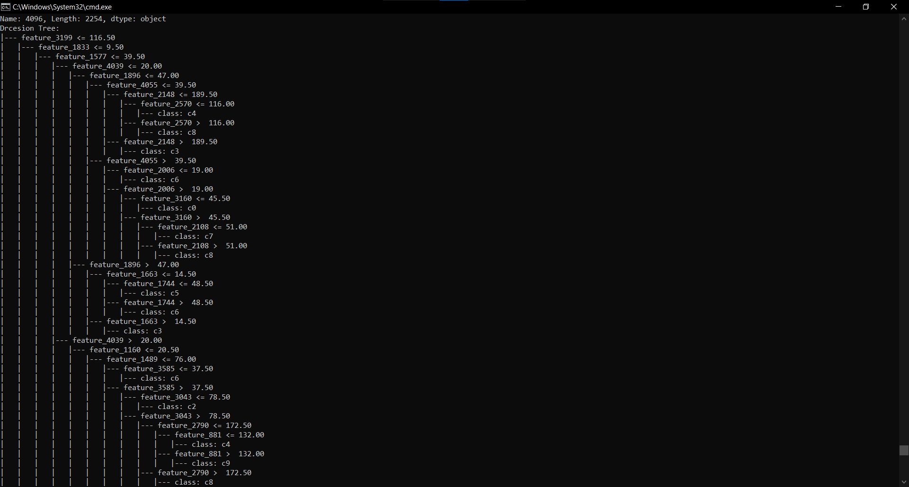

## Decision Tree
Decision Trees are a type of Supervised Machine Learning where the data is continuously split according to a certain parameter. The tree can be explained by two entities, namely decision nodes and leaves. The leaves are the decisions or the final outcomes. And the decision nodes are where the data is split.

Decision Tree in Pictorial Form: 

# 

Decision Tree in Command Line: 

# 
